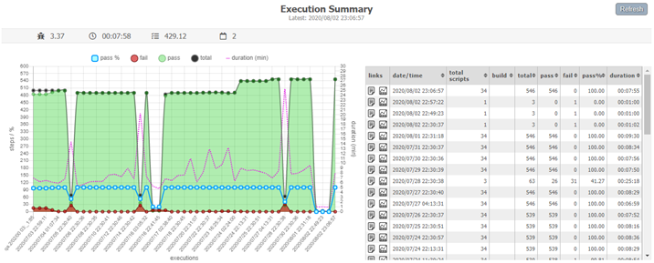
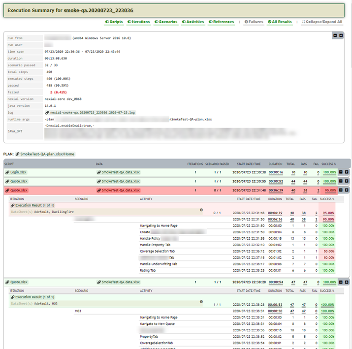

# execution-dashboard
> Execution Dashboard creation via a set of Nexial scripts

### Introduction
This project is an extension to [Nexial Automation Platform](https://github.com/nexiality/nexial-core/). Its main 
goal is to provide insights into the executions of Nexial automation script. Its main output is an Execution Dashboard,
which can be rendered in a few different ways:<br/>

- Execution Dashboard displayed in portrait mode:<br/>

- Execution Dashboard displayed in landscape mode:<br/>


Besides the chart and the execution summary grid, this dashboard also has the capability to drill
down to the next level of execution stats:<br/>
<br/>

.. and links to the corresponding execution summary:<br/>
<br/>

As a web page, the dashboard can be hosted in a variety of ways, making it highly accessible to its audience. It is
also easily to embed the execution dashboard as IFRAME into existing web pages and web applications.


### How It Works
[More details coming soon...]

At a high level, here's the flow:
1. Nexial is properly set up to use AWS S3 (or its alternative such as [MinIO](https://github.com/minio/minio) as its 
   execution output storage:
   - use [`nexial-setup`](https://nexiality.github.io/documentation/userguide/BatchFiles#nexial-setupcmd--nexial-setupsh)
     to set up one's Nexial for such capability.
2. Nexial executions are invoked with the following System variables assigned:
   - [`nexial.outputToCloud`](http://nexiality.github.io/documentation/systemvars/index#nexial.outputToCloud)
     System variable set to `true`.
   - [`nexial.runID.prefix`](https://nexiality.github.io/documentation/systemvars/index#nexial.runID.prefix)
     System variable is correctly set up.
3. By executing script using the above configuration, execution results will be stored to AWS S3.
4. The [`execution-summary`](execution-summary/artifact/script/execution-summary.xlsx) script is independently run
   to collect the execution results into a single "summary" JSON file. At runtime, be sure to include all the 
   pertinent information such as AWS credential, project name, etc. 
5. This "summary" JSON file is the data input for the Execution Dashboard.


### How To Run It
To run the [`execution-summary`](execution-summary/artifact/script/execution-summary.xlsx) script, be sure to include
the following data variables from command line:
1. `execdash.aws.accessKey` - the `ACCESS_KEY` to access the S3 bucket used as Nexial execution output storage
2. `execdash.aws.secretKey` - the `SECRET_KEY` to access the S3 bucket used as Nexial execution output storage
3. `execdash.aws.region` - the region where the said S3 bucket is located
4. `execdash.aws.url` - (S3 alternative only) the URL of the target bucket; not necessary if AWS S3 is used 
4. bucketName - the name of the said S3 bucket
5. artifactSubdir - the sub-directory under the said S3 bucket used as the base directory for all Nexial execution 
   output
6. summarySubdir - the sub-directory under the said S3 bucket used as the base directory for all Nexial dashboard data
7. project - the name of the project from which the execution dashboard will be generated
8. prefix - this should match `nexial.runID.prefix` used during Nexial execution

For example,
```
nexial.cmd -script C:\projects\execution-summary\artifact\script\execution-summary.xlsx \
    -override execdash.aws.accessKey=ABCDEFGHIJ... \ 
    -override execdash.aws.secretKey=ABCDEFGHIJ... \ 
    -override execdash.aws.region=us-west-2 \
    -override bucketName=nexial-bucket-123 \
    -override artifactSubdir=outputs \ 
    -override summarySubdir=summaries \
    -override project=MyProject \
    -override prefix=SyntheticTransactions
```


### Get Involved
All help and support WELCOME! We are looking to add more features to the dashboard, as well as expanding the analysis
portion. If you have some spare cycle -- join us to improve this project! If you have a good idea for Execution 
Dashboard, we'd love to hear about it!

---
